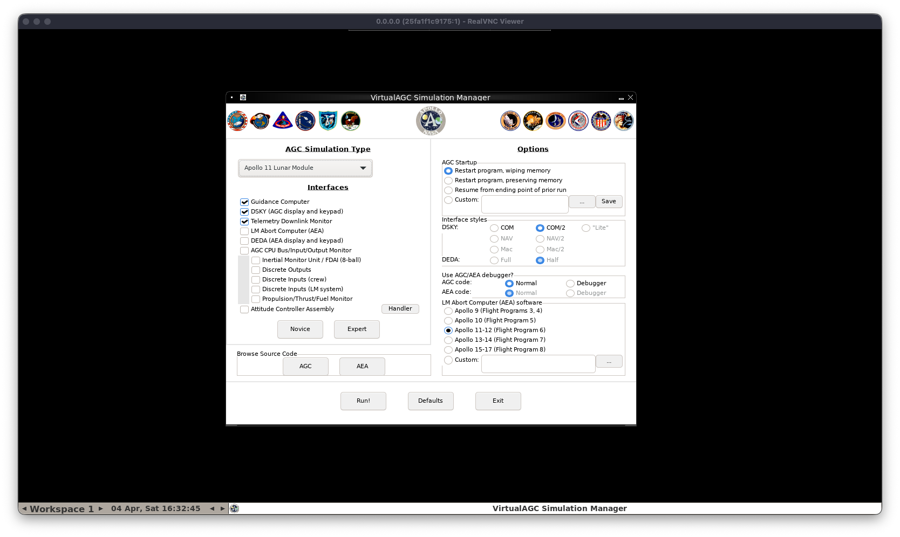

# VirtualAGC Docker Deployment

This project provides a Dockerized deployment of [VirtualAGC](https://github.com/virtualagc/virtualagc) - a virtual Apollo Guidance Computer (AGC) emulator that runs the original Apollo mission software.



## What is VirtualAGC?

VirtualAGC is an emulator for the Apollo Guidance Computer (AGC), the groundbreaking embedded computer that guided the Apollo missions to the Moon. This project:

- Emulates the AGC processor and its software
- Provides a graphical interface via web-based VNC
- Allows you to experience the original Apollo mission software firsthand

## Features

- **Web-based interface**: Access via noVNC in your browser
- **X11 graphical environment**: Runs fluxbox window manager with AGC interface
- **VNC access**: Direct VNC connection support on port 5900
- **Cross-platform**: Tested on Docker in Windows (WSL and native), macOS (Apple Silicon and Intel), and Linux (Ubuntu 22.04+)
- **No full clone required**: Docker scripts can be downloaded and deployed without cloning the full VirtualAGC repo - the container builds from source automatically

## Quick Start with Docker Compose

```bash
docker-compose up -d
```

## Quick Start with Docker

```bash
docker build -t virtualagc .
docker run -d -p 6080:6080 -p 5900:5900 --name apollo11-demo virtualagc
```

**Note**: The Docker build process will automatically clone and compile VirtualAGC from source. You don't need to clone the full repository first - just the Docker directory contents are needed.

## Accessing the Interface

Once the container is running, access the VirtualAGC interface through:

1. **Web Browser (noVNC)**: http://localhost:6080/vnc.html
2. **Direct VNC**: Connect your VNC client to `localhost:5900`

## Ports

| Port | Service | Description |
|------|---------|-------------|
| 6080 | noVNC   | Web-based VNC interface (HTML5) |
| 5900 | VNC     | Direct VNC connection |

## Configuration

### Environment Variables

| Variable | Default | Description |
|----------|---------|-------------|
| DISPLAY | :1 | X11 display number |

### Adjusting VNC Resolution

The VNC screen resolution is configured in the `start.sh` script. To change it, modify this line in `start.sh`:

```bash
Xvfb :1 -screen 0 1600x900x24 &
```

Change `1600x900x24` to your desired resolution (width x height x bit depth). For example:
- `1920x1080x24` for Full HD
- `1280x720x24` for HD
- `2560x1440x24` for QHD

## Stopping the Container

```bash
# With Docker Compose
docker-compose down

# With Docker
docker stop apollo11-demo
docker rm apollo11-demo
```

## Building from Source

To rebuild the Docker image:

```bash
docker-compose build
# or
docker build -t virtualagc .
```

## Technical Details

### Architecture

- **Base Image**: Ubuntu 22.04 (linux/amd64 platform)
- **Window Manager**: Fluxbox (lightweight X11 window manager)
- **Virtual Display**: Xvfb (X Virtual Framebuffer) at 1600x900x24
- **VNC Server**: x11vnc
- **Web VNC**: websockify + noVNC

### Build Process

1. Base Ubuntu image with development tools
2. Clones the VirtualAGC repository
3. Compiles the AGC emulator
4. Sets up X11 environment with fluxbox
5. Configures VNC access via x11vnc
6. Web access via websockify proxying to VNC

## Troubleshooting

### Container won't start

Check logs:
```bash
docker logs apollo11-demo
```

### Cannot access web interface

Ensure ports are not already in use:
```bash
lsof -i :6080
lsof -i :5900
```

### VNC connection issues

Verify the container is running:
```bash
docker ps | grep apollo11-demo
```

## License

This deployment configuration is provided as-is. The VirtualAGC software itself is licensed under its original terms. Please refer to the [VirtualAGC repository](https://github.com/virtualagc/virtualagc) for more information.
